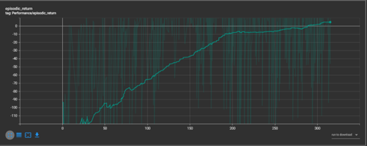
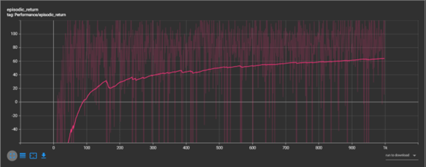

# Lunar Lander Using DDPG and SAC

This project implements DDPG and SAC for the OpenAi Gym Lunar Lander environment.


## Prerequisites

1. **Anaconda/Miniconda(Optional)**: We will use conda to manage the project's virtual environment.
2. **Python 3.10**: The project is tested with Python 3.10.
3. **PyTorch**: A deep learning framework.
4. **OpenAI Gym**: A toolkit for developing and comparing reinforcement learning algorithms.
5. **Tensorboard**: A toolkit for visualization of training logs.

## Installation

### Step 1: Install Anaconda or Miniconda(Optional)

- **Anaconda**: [Installation Guide](https://docs.anaconda.com/anaconda/install/#installation)
- **Miniconda**: [Installation Guide](https://docs.conda.io/en/latest/miniconda.html)

### Step 2: Create and Activate a Conda Environment

Open the terminal (Anaconda Prompt on Windows) and run the following commands:

```bash
$ conda create -n myenv python=3.10
$ conda activate myenv
```

### Step 3: Install PyTorch

Visit [PyTorch](https://pytorch.org/get-started/locally/) Installation and follow the instructions to install PyTorch for your system. For example:

```bash
(myenv)$ pip install torch torchvision torchaudio
```

### Step 4: Install OpenAI Gym

```bash
(myenv)$ pip install gymnasium[classic-control]
```

More details at [OpenAI Gym Documentation](https://gymnasium.farama.org/).

### Step 4: Install Tensorboard

```bash
(myenv)$ pip install tensorboard==2.13.0
```

More details at [Tensorboard Documentation.](https://pytorch.org/tutorials/intermediate/tensorboard_tutorial.html).

## Running the Code

### Step 1: Clone the repository

```bash
git clone https://github.com/minnakan/LunarLander_RL.git
cd LunarLander_RL
```

### Step 2: Run the implementation

```bash
(myenv)$ python run_ddpg.py
```

## Results

The performance of the DDPG and SAC agent was measured by episodic returns over the training period. The following figures show the results:




